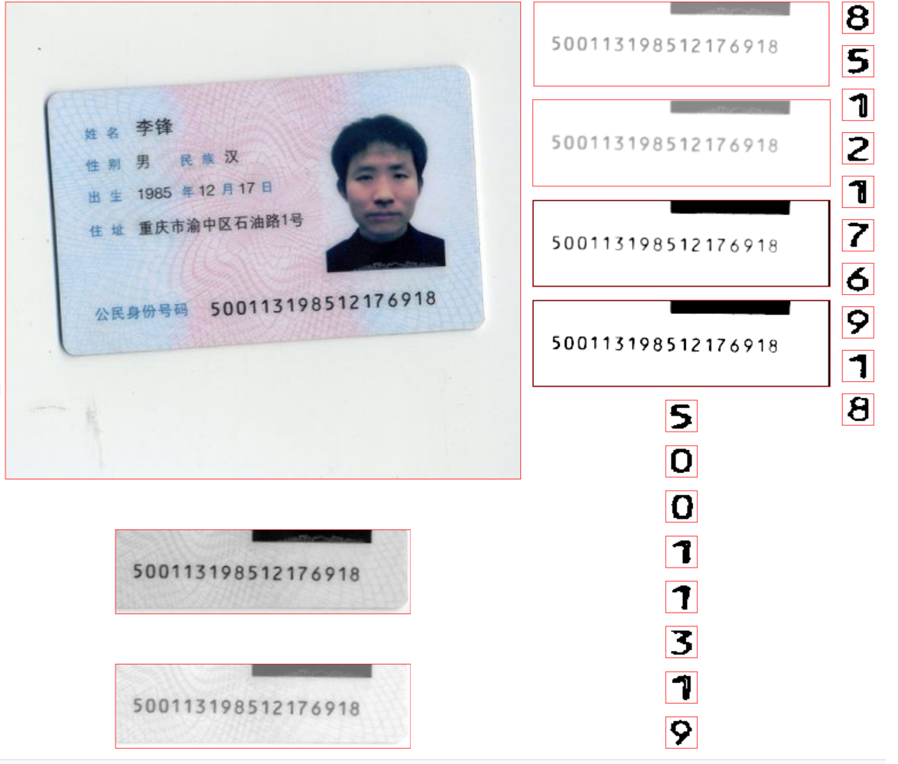

# [Deprecated] 本项目已经迁移至新repo ==> [Evil 身份证、银行卡、等OCR识别](https://github.com/evilgix/Evil)

# ChineseIDCardOCR
🇨🇳中国二代身份证光学识别

## 2017.09.21 Change Log 
使用 `Vision` 和 `CoreML`替换原来的 `FFNN`

TODO 如何生成训练数据，训练神经网络，转换 *.h5 -> *.mlmodel

# 交流讨论

	1.github issue (推荐)
	2.qq 群：641256202
	
	
#### 如何体验  

 - Xcode9, iOS 11
 -  git clone `https://github.com/KevinGong2013/ChineseIDCardOCR`
 - Build && Run

````
由于自己电脑性能问题，训练的神经网络对一些质量较差的图片识别率不是很高～
````

#### 图片处理过程



# LICENSE
	 Apache License
	 Version 2.0, January 2004
	 http://www.apache.org/licenses/	

Copyright 2017 - 2018 Kevin.Gong aoxianglele#icloud.com
